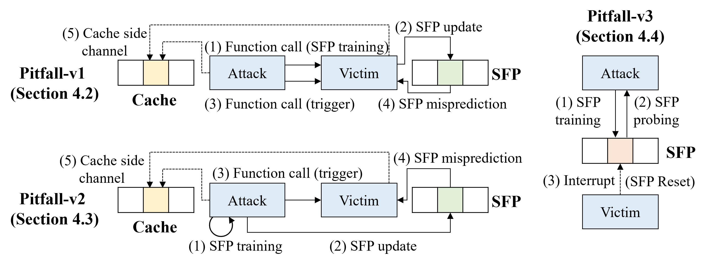

# Pitfall

## Introduction

This research identifies the existence of the Store Forwarding Predictor (SFP) in Intel CPUs and proposes Pitfall, a novel side-channel attack based on this predictor.

The SFP is used to predict whether a store-load pair with an unknown data dependence accesses the same memory address. If predicted to be the same, the CPU speculatively bypasses the store data to the load before the data dependence is resolved, which improves memory instruction parallelism. Our research demonstrates that Intel's SFP can share prediction table entries among store-load pairs with different addresses. Specifically, an entry collision occurs when the lowest 16 bits of the virtual addresses of the store and load are identical, enabling cross-address training and exploitation. Furthermore, we find that the SFP is flushed during context switches. While this ensures isolation across different processes and privilege levels, it exposes a new attack surface: using the SFP to detect the occurrence of interrupts.

Pitfall comprises two novel transient execution attacks (Pitfall-v1 and Pitfall-v2) and a website fingerprinting attack (Pitfall-v3). The attack flows for all three are illustrated in the figure below (Fig. 4 in the paper).



Pitfall-v1 exploits the transient execution caused by SFP mispredictions to achieve an in-place Spectre attack within a single process. Pitfall-v2 leverages the characteristic that the SFP can share prediction entries across store-load instruction pairs with different addresses to achieve an out-of-place Spectre attack within a single process. Pitfall-v3 exploits the SFP's behavior of flushing during context switches.

The overall architecture of this artifact is as follows:

```shell
.
├── config.json                 # Customized configuration file
├── environment.yml             # Dependent python packages
├── fingerprinting-env-setup.sh # Pitfall-v3 browser environment setup
├── py-env-setup.sh             # Python environment setup
├── LICENSE
├── README.md
├── main.py             # Main entry for the testing program
├── fingerprinting      # Codes related to Pitfall-v3 website fingerprinting
├── figure              # Experimental result charts and sample images
├── lib                 # Entry for each experiment
│   ├── fig2.py         # SFP existence identification, corresponds to Fig. 2
│   ├── fig3.py         # SFP cross-address collision, corresponds to Fig. 3
│   ├── fig6.py         # Pitfall-v1 leakage accuracy evaluation, corresponds to Fig. 6
│   ├── poc.py          # Attack PoC examples for Pitfall-v1 and Pitfall-v2
│   ├── v1.py           # Pitfall-v1 evaluation, corresponds to Table 2
|   ├── v2.py           # Pitfall-v2 evaluation, corresponds to Table 2
│   └── v3.py           # Pitfall-v3 evaluation, corresponds to Fig. 8
└── src                 # Implementation code for all experiments
    ├── existence       # SFP existence identification, corresponds to Fig. 2
    │   ├── fig-2.c
    │   ├── fig-2.make
    │   └── fig-2.S
    ├── org             # SFP cross-address collision, corresponds to Fig. 3
    │   ├── fig-3.c
    │   ├── fig-3.make
    │   └── fig-3.S
    ├── pitfall-v1      # Pitfall-v1
    │   ├── eval.c
    │   ├── fig-6.make
    │   ├── poc.c
    │   ├── v1.make
    │   └── v1-poc.make
    ├── pitfall-v2      # Pitfall-v2
    │   ├── eval.c
    │   ├── poc.c
    │   ├── v2.make
    │   └── v2-poc.make
    └── pitfall-v3      # Interrupt probing code for Pitfall-v3
        ├── asm.S
        ├── eval.c
        └── main.c
```

## Environment Setup

This code uses `conda` to create the Python environment. We recommend installing Miniconda using the following commands:

```shell
curl -O https://repo.anaconda.com/miniconda/Miniconda3-latest-Linux-x86_64.sh
bash Miniconda3-latest-Linux-x86_64.sh 
```

Next, follow the instructions in the `Miniconda3-latest-Linux-x86_64.sh` script to complete the `conda` installation. Then, run the following command to set up the Python environment:

```shell
./py-env-setup.sh
```

Expected output is as follows:

```shell
...
Solving environment: done
#
# To activate this environment, use
#
#     $ conda activate pitfall-env
#
# To deactivate an active environment, use
#
#     $ conda deactivate
```

Next, run the following command to configure the browser testing environment:

```shell
./fingerprinting-env-setup.sh
```

Expected output is as follows:

```shell
...
Creating executable shortcuts...
Chrome version:
Google Chrome for Testing 149.0.7827.55 
ChromeDriver version:
ChromeDriver 149.0.7827.55 (3188f8a607ae7e067593be8aab7f02d2451fec07-refs/branch-heads/7827@{#1982})
```

## Build and Run

Activate the created Python virtual environment:：

```shell
conda activate pitfall-env
```

All experiments are executed via `main.py` and accept command-line arguments:

```shell
main.py [-E <experiment-name>] [-C <cpu-id>]
```

Here, `<experiment-name>` specifies the experiment to run, including the following options:

- `fig2`: SFP existence identification experiment, corresponds to Fig. 2 in the paper
- `fig3`: SFP cross-address collision experiment, corresponds to Fig. 3 in the paper
- `fig6`: Pitfall-v1 accuracy evaluation for leaking data of various lengths, corresponds to Fig. 6 in the paper
- `v1`: Pitfall-v1 evaluation, corresponds to Table 2 in the paper
- `v2`: Pitfall-v2 evaluation, corresponds to Table 2 in the paper
- `v3`: Pitfall-v3 PoC for identifying specific websites, corresponds to Fig. 8 in the paper
- `v1-poc`: Pitfall-v1 string leakage PoC example
- `v2-poc`: Pitfall-v2 string leakage PoC example
- `all`: Sequentially executes fig2, fig3, fig6, v1, v2, and v3 experiments (Default)

Additionally, `<cpu-id>` indicates the processor core ID to which the SFP experiment/exploit code is bound. This defaults to the maximum processor core ID supported by the system.

### Customized Configuration

Configure file `config.json` can be modified to customize the attack configurations. The currently supported attributes include:

- `fig6_test_byte_range`: The maximum length of leaked bytes when running experiments related to Fig. 6 (i.e., the Pitfall-v1 accuracy evaluation for leaking data of various lengths)
- `pitfall_v1_eval_byte_size`: The length of leaked bytes when running the Pitfall-v1 evaluation experiment
- `pitfall_v2_eval_byte_size`: The length of leaked bytes when running the Pitfall-v2 evaluation experiment
- `pitfall_v1_poc_string`: The target string to be leaked, stored within the victim's memory space, when running the Pitfall-v1 PoC code
- `pitfall_v2_poc_string`: The target string to be leaked, stored within the victim's memory space, when running the Pitfall-v2 PoC code

## Research Paper

For detailed methodology and experimental evaluations, please refer to the paper **Pitfall: Uncovering and Exploiting the Store Forwarding Predictor on Intel CPUs**, which has been accepted by *the 17th International Symposium on Advanced Parallel Processing Technology (APPT 2026)*.

## License

This project is licensed under the GPL-3.0.
